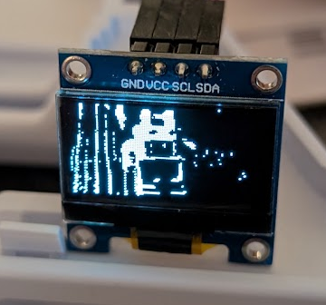
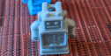
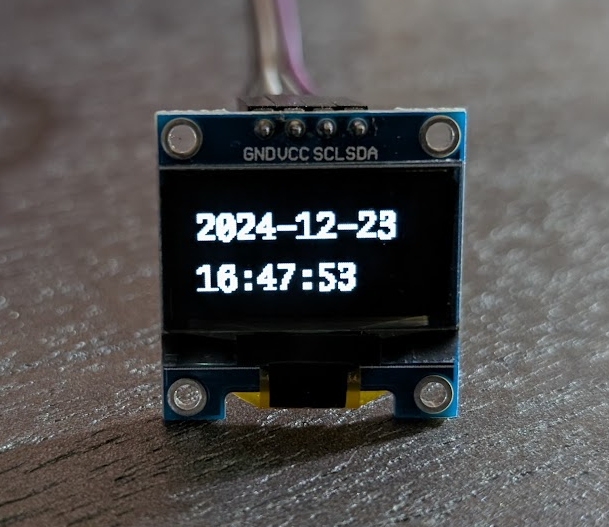

# ssd1306 - Go package to display images on an SSD1306 device.

## Overview

I got some of these [128x64 monochrome OLED SSD1306
devices](https://www.amazon.com/s?k=SSD1306) for a project that uses a
Raspberry Pi and developed this package to display images on
them. That is, display images like this:



The datasheet for these devices is:

https://www.digikey.com/htmldatasheets/production/2047793/0/0/1/ssd1306.html

Automated package documentation for this Go package should be
available from [](https://pkg.go.dev/zappem.net/pub/io/device/ssd1306).

## Hello world example

Connect the SSD1306 device to the Raspberry Pi pins
as follows ([Pin numbering diagram](https://pinout.xyz/)):

| SSD1306 pin | Raspberry Pi pin   |
|-------------|--------------------|
|  GND        |  (Pin 6) Ground    |
|  VCC        |  (Pin 1) 3v3 Power |
|  SCL        |  (Pin 5) GPIO 3    |
|  SDA        |  (Pin 3) GPIO 2    |

First, make sure i2c support is enabled on your Raspberry Pi. Log in
and run the `raspi-config` command, and enable "interface options" ->
"i2c enable". Save this configuration.

On your development computer, with the `go` and `git` toolchains
installed, follow these instructions to build the example program.

Cross compiling to make something runable on a Raspberry Pi binary can
be done as follows:
```bash
$ git clone https://github.com/tinkerator/ssd1306.git
$ cd ssd1306
$ go mod tidy
$ GOARCH=arm GOOS=linux go build example/display.go
```

Copy the compiled `./display` binary and the example image file
`./mini.png` to a Raspberry Pi. For reference, the 128x64 pixel
example image file looks like this:



Logged into the Raspberry Pi, you can now run the following command and display a monochrome approximation of that image:

```bash
pi@rpi:~ $ ./display --image mini.png
pi@rpi:~ $
```

This should make the SSD1306 display the image shown at the top of
this README.

The `./display` command can do a few other things. You can explore
these with the `--help` command.

```
pi@rpi:~ $ ./display --help
Usage of ./display:
  -image string
    	PNG file
  -pixel int
    	pixel displayed when gray no smaller (default 125)
  -x int
    	width of a rectangle (ignored if --image) (default 19)
  -y int
    	height of a rectangle (ignored if --image) (default 8)
```

If you want to explore different approximations of the image, you can
select different values for `--pixel` from the default of `125`. For
example, try the following 3 settings:

```
pi@rpi:~ $ ./display --image mini.png --pixel=100
pi@rpi:~ $ ./display --image mini.png --pixel=110
pi@rpi:~ $ ./display --image mini.png --pixel=200
```

Finally, without the `--image` argument, the `./display` program will
just display a rectangle of dimensions `--x` and `--y` occupying the
top left corner of the display. (This was surprisingly effective for
debugging the code.)

## Displaying text

Given that we can render an image on the display, we can render text
to an image and display that. A second example, `clock`, does just
that:

```
$ GOARCH=arm GOOS=linux go build example/clock.go
```

And then copy and run `./clock` to a Raspberry Pi and run it:

```
pi@rpi:~ $ nohup ./clock > /dev/null 2>&1 &
```

The Raspberry Pi and `ssd1306` display becomes a digital clock:



## TODOs

Nothing planned, but submit a bug if you have some ideas.

## License info

The `ssd1306` package is distributed with the same BSD 3-clause
license as that used by [golang](https://golang.org/LICENSE) itself.

## Reporting bugs and feature requests

The package `ssd1306` has been developed purely out of self-interest and a
curiosity for physical IO projects, primarily on the Raspberry
Pi. Should you find a bug or want to suggest a feature addition,
please use the [bug
tracker](https://github.com/tinkerator/ssd1306/issues).
